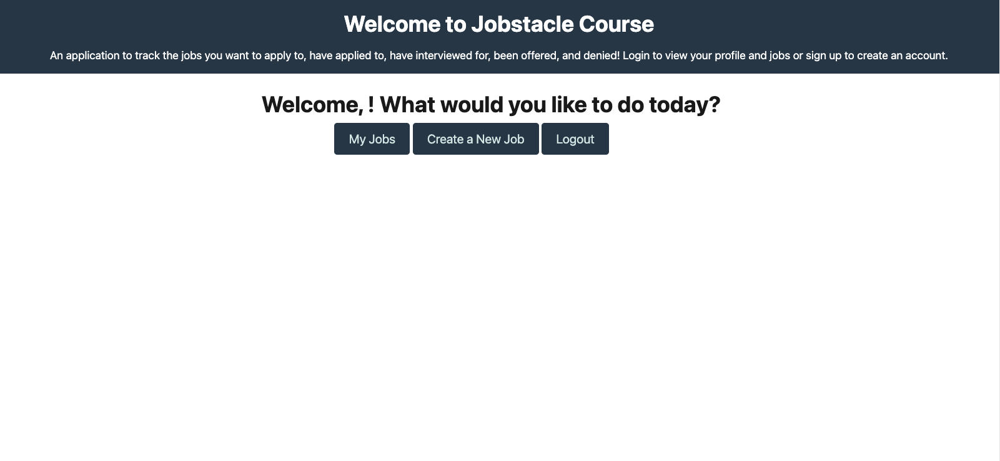

<h1 align="center">Jobstacle Course 🚀☄️</h1>

    
    
    
    
    

  

    
    
    
    
    
    
    
    
    

## Description
A web application that allows bootcamp students to track🖊️📔 their application process post Bootcamp!

📼Below is a screenshot showing the functionality of the application:

#

## Table of Contents
- [Description](#description)
- [Table of Contents](#table-of-contents)
- [Usage](#usage)
- [Testing](#testing)
- [Contributing](#contributing)
- [Future Developments](#future-developments)
- [Questions](#questions)
#
## Usage
💻   👨‍🔧  👩‍🔧
1. Access the application through the following link: [Jobstacle Course](heorku link once deployed)

2. Start by registering for an account, enter desired username and password and press the 'Sign up' button to registered

3. The 'Sign up buton' will take the user to the dashboard where they can view their pending applications, add new applications or logout from the application

4. Enter the appropriate information in the input form after clicking the 'Create a New Job' button and click 'Submit' to create the new application

5. Once an application has been created, the user will be able to view it after clicking the  'My Job' tab

6. The user will be able to delete and update each job application accordingly once inside hte 'My Job' tab

#
## Testing
🧪👨‍💻

No testing is currently set up

#
## Contributing
:octocat: [Melissa Vaughn](https://github.com/Meljska-Fawn)

:octocat: [Wendy Vu](https://github.com/chewytaro)

:octocat: [Kyle Parks](https://github.com/Goobber33)

:octocat: [George Lin](https://github.com/lingeorge88)
  
#
## Future Developments
🏗️🚧
- Allow users to see popular jobs that other users' have applied to

- Allow users to use their LinkedIN or other third-party credentials to login

- Add a tool that allows users to set their weekly goals and tracks the amount of applications they have submitted

#
## Questions
✉️ Contact us with any further questions:  [GitHub](https://github.com/chewytaro/Jobstacle-course) 